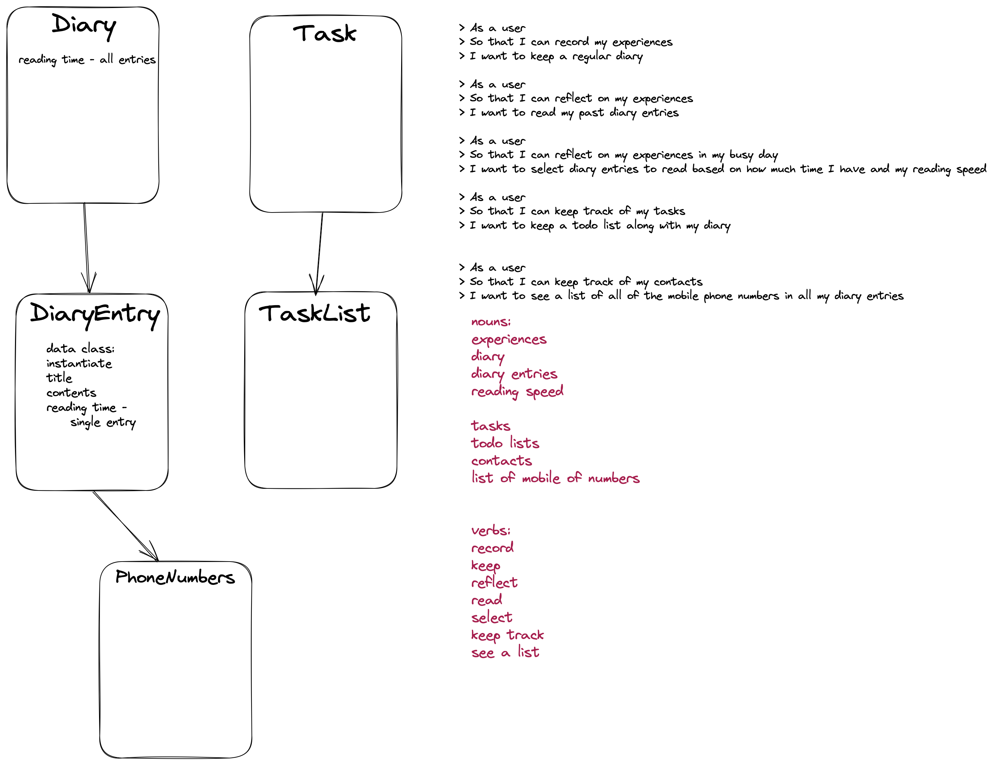

# Music Tracker class Design Recipe

## 1. Describe the Problem

_Put or write the user story here. Add any clarifying notes you might have._

> As a user
> So that I can record my experiences
> I want to keep a regular diary

> As a user
> So that I can reflect on my experiences
> I want to read my past diary entries

> As a user
> So that I can reflect on my experiences in my busy day
> I want to select diary entries to read based on how much time I have and my reading speed

> As a user
> So that I can keep track of my tasks
> I want to keep a todo list along with my diary

> As a user
> So that I can keep track of my contacts
> I want to see a list of all of the mobile phone numbers in all my diary entries




## 2. Design the class system

_Consider diagramming out the classes and their relationships. Take care to focus on the details you see as important, not everything._
_The diagram below uses asciiflow.com but you could also use excalidraw.com, draw.io, or miro.com_

_Include the initializer, public properties, and public methods with all parameters, return values, and side-effects._

```python 

class Diary():
    def __init__(self):
        pass
    
    


class DiaryEntry():
    def __init__(self, title, contents):
        #parameters - 
            #title is a string represnting the title of the diary entry
            #contents is also a string
        #side effects - 
            #set title and contents properties
    pass

    def format(self):
        #no parameters
        # returns 
        # formats diary entry to "3rd May 2023, Dear Diary......."
    
    pass

    def reading_time(self, wpm)
        #parameters - 
            #integer - words per minute that can be read from the contents
        #returns - 
            # integer/ceil(roundup) - the number of minutes it takes to read the diary entry

    pass

    def word_count(self):
        #no parameters
        #returns - 
        # returns word count of contents


class PhoneNumbers():
    pass

class Task():
    pass

class TaskList():
    pass


```

## 3. Create Examples as Integration Tests

_Create examples of the classes being used together in different situations and combinations that reflect the ways in which the system will be used._

# EXAMPLE

```python


```


## 4. Create Examples as Unit Tests

_Create examples, where appropriate, of the behaviour of each relevant class at a more granular level of detail._

# EXAMPLE

```python


```

## 4. Implement the behaviour

_After each test you write, follow the test-driving process of red, green, refactor to implement the behaviour._
